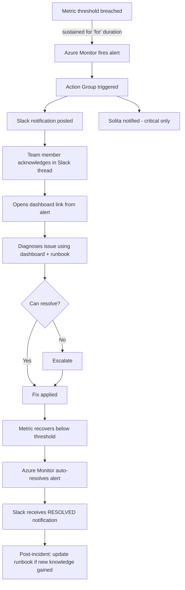

# One pager: Alerting Design Proposal for Transitdata Pipeline

## What?

Design and implement a structured alerting system for the Transitdata real-time pipeline using **Azure Monitor Prometheus alert rules**, **Azure Action Groups**, and **Slack notifications**. This replaces the legacy Azure Monitor custom metrics alerting (three CronJobs pushing metrics to a VM) with alerts evaluated directly against the managed Prometheus metrics already collected from AKS workloads.

The proposal covers: alert philosophy, technology architecture, severity taxonomy, alert visual design, incident response process, threshold design for avoiding false positives, a complete alert rule catalog with PromQL expressions, a migration map from legacy static alerts, and phased implementation.

## Why?

The Transitdata Pipeline feeds Google Maps, Reittiopas, bus stop signs, and third-party applications with real-time public transport data for the Helsinki region. When the pipeline breaks, hundreds of thousands of passengers get wrong arrival times, missing vehicle positions, or no service alerts.

**Current state of alerting:**

- **No Prometheus alerting rules exist** in either dev or prod. Only auto-generated recording rules (Node/Kubernetes metrics).
- **Legacy alerts use custom metrics pushed by CronJobs** to a VM (`vm-aksinfosys-dev-001` / `VM-AKSINFOSYS-PROD-JBX`), evaluated by Azure Monitor metric alerts. This is indirect, fragile, and adds a failure point (the CronJob itself).
- **Most prod MQTT alerts are DISABLED** -- the dynamic threshold approach produced too many false positives.
- **Severity model is inconsistent** -- dev alerts are Sev 4 (Informational), prod Pulsar alerts are Sev 0 (Critical).
- **No runbooks, no dashboard links** in alert notifications -- when an alert fires, the responder has no guidance on where to look or what to do.
- **Slack notifications via email-to-channel** (not webhooks) -- limited formatting, no structured fields.

**The new Prometheus + Grafana monitoring stack is ready** (Azure Managed Prometheus + Managed Grafana deployed in both dev and prod), and the [Monitoring Dashboard Design](./Monitoring-Dashboard-Design.md) defines the dashboard hierarchy that alerts should link to. What's missing is the alerting layer.

## How?

### 1. Alert Philosophy

Three rules govern our alerting:

1. **Every alert must be actionable.** If you cannot do anything about it, it belongs on a dashboard, not in an alert. Alerts that cannot be acted upon create noise and erode trust.
2. **Every alert must link to a dashboard and a runbook.** Alerts without context create panic, not speed. The `dashboard_url` annotation points to the relevant Grafana dashboard. The `runbook_url` annotation points to a troubleshooting guide.
3. **Fewer, better alerts.** Alert fatigue is the biggest enemy of incident response. Start with a small set of high-confidence alerts and expand gradually.

**What we alert on:** Conditions that affect data delivery to consumers -- feed failures, pipeline stalls, broker disconnections, infrastructure failures threatening availability.

**What we do NOT alert on:** Normal traffic variance (dips at night, weekends), capacity planning metrics (review on dashboards periodically), transient blips shorter than the `for` duration, or metrics that are informational only.

---

### 2. Technology: Azure Monitor Prometheus Alert Rules vs. Grafana Alerting

We use **Azure Monitor Prometheus alert rules**, not Grafana-managed alerting. Both are viable, but Azure Monitor is the better fit for our setup.

| Aspect | Azure Monitor Prometheus Rules | Grafana-Managed Alerting |
|--------|-------------------------------|--------------------------|
| **Rule evaluation** | Runs on Azure Monitor infrastructure, independent of Grafana | Runs inside the Grafana instance |
| **Availability** | Rules persist and evaluate even if Grafana is down or restarting | If Grafana goes down, alerting stops |
| **Notification routing** | Azure Action Groups: built-in Slack, email, SMS, webhook, Logic Apps, Functions | Grafana contact points: email, Slack webhook, PagerDuty, etc. |
| **Suppression / maintenance** | Azure Monitor alert suppression rules (scheduled, scope-based) | Grafana silences and mute timings |
| **IaC support** | Terraform `azurerm_monitor_alert_prometheus_rule_group`, ARM/Bicep, Azure CLI | Grafana provisioning YAML, Terraform grafana provider |
| **Management UI** | Azure Portal (alerts blade, alert history, smart detection) | Grafana Alerting UI |
| **Integration with existing setup** | Aligns with existing Action Groups (`infosys-send-to-slack`, Solita cross-sub group) already used by legacy alerts | Would require setting up new contact points |
| **Rule format** | Standard Prometheus alerting rule syntax (PromQL `expr`, `for`, `labels`, `annotations`) | Grafana-specific rule model (conditions, queries, folders) |

**Decision: Azure Monitor Prometheus alert rules** because:
- Alert evaluation is decoupled from Grafana availability
- Existing Action Groups (including the cross-subscription Solita vendor group) can be reused directly
- Standard Prometheus rule syntax is portable and well-documented
- Aligns with the existing Terraform-managed infrastructure pattern (`azure-infra-aks` repo)

---

### 3. Technology Architecture

```
AKS Workloads (metrics-exporter, Pulsar, kube-state-metrics)
        |
        | scraped by
        v
Azure Managed Prometheus (Azure Monitor Workspace)
  Dev:  defaultazuremonitorworkspace-weu  (rg: defaultresourcegroup-weu)
  Prod: amw-infosys-prod-weu             (rg: rg-aksinfosys-prod-weu)
        |
        | evaluated by
        v
Azure Monitor Prometheus Alert Rule Groups
  (PromQL expressions with `for` duration)
        |
        | fires when condition sustained
        v
Azure Action Groups
  +---> infosys-send-to-slack[-dev]     (Slack via email-to-channel)
  +---> infosys-send-to-email[-prod]    (email, escalation)
  +---> Common solita alerts prod       (vendor monitoring, cross-sub)
        |
        v
Slack channels + Azure Portal alert history
```

#### Action Groups

Existing Action Groups will be reused. For the static-equivalent alerts (Phase 2), the prod rules must reference the cross-subscription Solita action group to maintain the current dual-routing behavior.

| Action Group | Subscription | Used For |
|---|---|---|
| `infosys-send-to-slack-dev` | HSLAZ-CORP-DEV-INFOSYS | All dev alerts |
| `infosys-send-to-slack` | HSLAZ-CORP-PROD-INFOSYS | All prod alerts |
| `infosys-send-to-email-prod` | HSLAZ-CORP-PROD-INFOSYS | Escalation for critical alerts |
| `Common solita alerts prod` | hsl-governance-common (`B13714ED-...`) | Vendor monitoring -- used by critical pipeline-stall alerts |

#### Dev vs. Prod

- Separate Prometheus alert rule groups per environment, scoped to the respective Azure Monitor Workspace.
- Dev thresholds may be more relaxed (lower traffic volumes).
- Dev alerts fire to `transitdata-dev-monit` Slack channel; prod alerts to `azure-transitdata-monitoring` channel.

#### Infrastructure as Code

| Approach | Status | When to use |
|----------|--------|-------------|
| **Azure Portal / CLI** | Available now | Initial setup and rapid iteration during threshold tuning |
| **Terraform** (`azurerm_monitor_alert_prometheus_rule_group`) | Future target | Once rules are stable, codify in `azure-infra-aks` repo alongside existing Terraform-managed resources |

The existing legacy alerts are tagged `managedby: terraform` and `repository: azure-infra-aks`. The new Prometheus alert rules should follow the same pattern once the Terraform setup for `prometheusRuleGroups` resources is established.

---

### 4. Alert Taxonomy

#### Severity Levels

| Severity | Azure Sev | Meaning | Expected Response | Default `for` Duration |
|----------|-----------|---------|-------------------|----------------------|
| **Critical** | 0 | Consumer-facing data delivery is impacted or at imminent risk | Immediate (minutes) | 5m |
| **Warning** | 1 | Degradation detected, not yet consumer-impacting, or partial impact | Within working hours | 10m |
| **Info** | 3 | Awareness only, no immediate action required | Next business day | 15m |

#### Domain Categories

| Category | What it covers | Primary metrics |
|----------|---------------|-----------------|
| GTFS-RT Output | Feed failures, staleness, empty feeds | `gtfsrt_*` |
| MQTT Ingestion | Broker connectivity, message flow | `mqtt_*` |
| Pulsar Pipeline | Backlog, throughput, consumer lag | `pulsar_*` |
| Infrastructure | Pod health, resource saturation | `kube_*`, `container_*` |

---

### 5. Alert Visual Design (Slack Notification)

Alerts arrive in Slack via the existing email-to-channel integration. The Azure Monitor common alert schema provides structured fields. A typical notification includes:

```
Alert Rule: GtfsrtFeedScrapeFailure
Severity: Critical (Sev 0)
Status: Fired
Environment: prod

Condition:
  gtfsrt_last_scrape_success == 0
  for url = "https://realtime.hsl.fi/realtime/trip-updates/v2/hsl"

Fired at: 2026-03-26 14:32 UTC

Dashboard: <link to Grafana GTFS-RT Overview>
Runbook: <link to runbook>
```

**Key design choices:**
- Start with the native email-to-channel format (already working for legacy alerts)
- Alert annotations include `dashboard_url` (links to the relevant Grafana dashboard from the [Monitoring Dashboard Design](./Monitoring-Dashboard-Design.md)) and `runbook_url`
- If richer formatting is needed in the future, a Slack incoming webhook with Azure Logic App transformation can replace the email integration

---

### 6. Incident Response Process



**Roles and escalation:**
- During business hours: any team member responds to the Slack notification
- Critical alerts (Sev 0): also routed to Solita vendor monitoring via `Common solita alerts prod` action group
- Escalation path: to be defined (see [Open Questions](#10-open-questions))

---

### 7. Threshold Design / Avoiding False Positives

The legacy dynamic-threshold MQTT alerts in prod are mostly **disabled** because they produced too many false positives. The new alerting system avoids this through careful threshold design:

#### 7.1 Principles

1. **Baseline first, alert second.** Before setting thresholds, observe each metric for at least 2 weeks in production using the monitoring dashboards. Record normal ranges during rush hours (06:00-09:00, 15:00-18:00 EET), off-peak, and nighttime (00:00-05:00 EET).

2. **`for` duration filters transient issues.** Every alert must sustain its condition for a minimum period before firing. This absorbs transient spikes, brief network blips, and processing bursts.

3. **Start conservative, tighten gradually.** Begin with wide thresholds (fewer false positives, possibly some missed issues). After observing the baseline and tuning, tighten thresholds to catch more subtle degradation.

4. **Time-of-day awareness.** Some metrics naturally drop at night (MQTT message rates, GTFS-RT entity counts). Initial thresholds accommodate nighttime lows. In the future, recording rules can compute hour-of-day baselines for anomaly-based alerting.

5. **Static thresholds over dynamic.** The legacy dynamic thresholds (Azure Monitor's ML-based sensitivity) proved unreliable for our use case. The new rules use explicit static thresholds with clear rationale, making them predictable and debuggable.

#### 7.2 Ongoing Tuning

- **Monthly review:** Examine alert firing history. If an alert fires more than 5 times per week without resulting in action, either fix the underlying cause or adjust the threshold.
- **Maintenance windows:** Use Azure Monitor alert suppression rules during planned maintenance (deployments, infrastructure changes).
- **Side-by-side validation:** During migration, run new Prometheus alerts alongside legacy alerts to compare behavior before decommissioning.

---

### 8. Alert Rule Catalog

All rules use standard Prometheus alerting rule syntax. They reference only metrics that are currently collected by the `transitdata-metrics-exporter`, Pulsar's built-in Prometheus exporter, or Kubernetes metrics. Future metrics (from Dashboard Design Phases 2-4) are listed separately in [section 8.5](#85-future-alerts-phase-4).

#### 8.1 GTFS-RT Feed Alerts

##### GtfsrtFeedScrapeFailure

```yaml
alert: GtfsrtFeedScrapeFailure
expr: gtfsrt_last_scrape_success == 0
for: 5m
labels:
  severity: critical
annotations:
  summary: "GTFS-RT feed scrape failing for {{ $labels.url }}"
  description: "The GTFS-RT feed at {{ $labels.url }} has been returning errors for more than 5 minutes. Consumers (Google Maps, Reittiopas, bus stop signs) may be receiving stale data."
  dashboard_url: "https://<grafana>/d/gtfsrt-overview"
  runbook_url: "https://github.com/HSLdevcom/team-infodevops/wiki/runbooks/gtfsrt-feed-down"
```

**Rationale:** `gtfsrt_last_scrape_success == 0` means the metrics exporter cannot reach the feed endpoint. 5-minute `for` duration filters transient network blips. Critical because downstream consumers rely on fresh feed data.

##### GtfsrtFeedStale

```yaml
alert: GtfsrtFeedStale
expr: >
  (rate(gtfsrt_timestamp_age_seconds_sum[5m])
  / rate(gtfsrt_timestamp_age_seconds_count[5m])) > 300
for: 5m
labels:
  severity: critical
annotations:
  summary: "GTFS-RT feed stale for {{ $labels.url }}"
  description: "Average feed timestamp age exceeds 5 minutes for {{ $labels.url }}. The pipeline is producing data but it is outdated."
  dashboard_url: "https://<grafana>/d/gtfsrt-overview"
  runbook_url: "https://github.com/HSLdevcom/team-infodevops/wiki/runbooks/gtfsrt-feed-stale"
```

**Rationale:** 300 seconds (5 minutes) means the feed header timestamp is significantly old. The pipeline may be running but producing stale output. Threshold should be tuned per feed type in Phase 3: vehicle positions should be fresher (~60s) than service alerts (~300s).

##### GtfsrtFeedZeroEntities

```yaml
alert: GtfsrtFeedZeroEntities
expr: >
  (rate(gtfsrt_entity_count_sum[5m])
  / rate(gtfsrt_entity_count_count[5m])) == 0
for: 10m
labels:
  severity: warning
annotations:
  summary: "GTFS-RT feed has zero entities for {{ $labels.url }}"
  description: "The feed at {{ $labels.url }} is being scraped successfully but contains zero entities for over 10 minutes. The pipeline may be producing empty output."
  dashboard_url: "https://<grafana>/d/gtfsrt-overview"
  runbook_url: "https://github.com/HSLdevcom/team-infodevops/wiki/runbooks/gtfsrt-zero-entities"
```

**Rationale:** Scrape succeeds but the feed is empty. Warning (not Critical) because it could be legitimate during very low traffic or for the service alerts feed at night. 10-minute `for` duration avoids false positives during feed rebuilds.

##### GtfsrtScrapeErrorRateHigh

```yaml
alert: GtfsrtScrapeErrorRateHigh
expr: >
  sum by (url) (rate(gtfsrt_scrape_attempts_total{result!="success"}[5m]))
  / sum by (url) (rate(gtfsrt_scrape_attempts_total[5m])) > 0.5
for: 10m
labels:
  severity: warning
annotations:
  summary: "GTFS-RT scrape error rate high for {{ $labels.url }}"
  description: "More than 50% of scrape attempts are failing for {{ $labels.url }} over the last 10 minutes. Intermittent connectivity issue."
  dashboard_url: "https://<grafana>/d/gtfsrt-overview"
  runbook_url: "https://github.com/HSLdevcom/team-infodevops/wiki/runbooks/gtfsrt-scrape-errors"
```

**Rationale:** Catches partial failure (some scrapes succeed, some fail). `GtfsrtFeedScrapeFailure` handles total failure. 50% error rate over 10 minutes indicates a real problem, not a single dropped request.

---

#### 8.2 MQTT Broker Alerts

##### MqttBrokerDisconnected

```yaml
alert: MqttBrokerDisconnected
expr: mqtt_connected == 0
for: 5m
labels:
  severity: critical
annotations:
  summary: "MQTT broker disconnected: {{ $labels.broker }}"
  description: "Connection to MQTT broker {{ $labels.broker }} has been down for more than 5 minutes. Data ingestion from this source is stopped."
  dashboard_url: "https://<grafana>/d/mqtt-overview"
  runbook_url: "https://github.com/HSLdevcom/team-infodevops/wiki/runbooks/mqtt-broker-disconnected"
```

**Rationale:** Clear binary signal. Critical because no connection means no data ingestion. For redundant HFP broker pairs (hfprec938 + hfprec939), consider refining in Phase 3: single-broker disconnect as Warning, both-down as Critical.

##### MqttConnectionLossRate

```yaml
alert: MqttConnectionLossRate
expr: rate(mqtt_connection_lost[15m]) > 0.2
for: 15m
labels:
  severity: warning
annotations:
  summary: "MQTT broker connection unstable: {{ $labels.broker }}"
  description: "Broker {{ $labels.broker }} is experiencing frequent connection losses (>1 per 5 min over 15 min). Data may be intermittently dropping."
  dashboard_url: "https://<grafana>/d/mqtt-overview"
  runbook_url: "https://github.com/HSLdevcom/team-infodevops/wiki/runbooks/mqtt-connection-unstable"
```

**Rationale:** Detects reconnection cycling -- the broker may appear connected at any point-in-time check but is losing and re-establishing connections. Longer `for` duration (15m) confirms the pattern is sustained.

##### MqttMessageRateDrop

```yaml
alert: MqttMessageRateDrop
expr: >
  sum by (broker, topic_filter) (rate(mqtt_messages_received_total[10m])) == 0
  and on (broker) mqtt_connected == 1
for: 10m
labels:
  severity: warning
annotations:
  summary: "MQTT broker connected but no messages: {{ $labels.broker }} {{ $labels.topic_filter }}"
  description: "Broker {{ $labels.broker }} is connected but receiving zero messages on {{ $labels.topic_filter }} for 10+ minutes. The upstream source may be down."
  dashboard_url: "https://<grafana>/d/mqtt-overview"
  runbook_url: "https://github.com/HSLdevcom/team-infodevops/wiki/runbooks/mqtt-no-messages"
```

**Rationale:** Connected but silent -- the problem is upstream (the publisher on the MQTT broker is not sending data). This is the Prometheus equivalent of the legacy STATIC alerts for MQTT feeds. Warning because some feeds may legitimately go silent at night. Requires baseline observation to confirm.

**Note:** For the legacy static alert equivalents (Metro HFP, Full APC, Service Alerts), this rule should be instantiated with specific `broker` and `topic_filter` label matchers. See [Legacy Static Alert Migration](#9-legacy-alert-migration).

---

#### 8.3 Pulsar Pipeline Alerts

##### PulsarBacklogCritical

```yaml
alert: PulsarBacklogCritical
expr: pulsar_msg_backlog > 100000
for: 5m
labels:
  severity: critical
annotations:
  summary: "Pulsar backlog critical: {{ $labels.topic }} / {{ $labels.subscription }}"
  description: "Backlog for topic {{ $labels.topic }} exceeds 100,000 messages. Consumer is likely down or severely degraded. Downstream GTFS-RT output is falling behind."
  dashboard_url: "https://<grafana>/d/pulsar-overview"
  runbook_url: "https://github.com/HSLdevcom/team-infodevops/wiki/runbooks/pulsar-backlog-critical"
```

**Rationale:** 100K messages represents severe consumer failure with significant data delivery delay. Starting threshold -- must be tuned per topic based on observed baseline in Phase 3.

##### PulsarBacklogGrowing

```yaml
alert: PulsarBacklogGrowing
expr: pulsar_msg_backlog > 10000
for: 10m
labels:
  severity: warning
annotations:
  summary: "Pulsar backlog growing: {{ $labels.topic }} / {{ $labels.subscription }}"
  description: "Backlog for topic {{ $labels.topic }} exceeds 10,000 messages for over 10 minutes. A downstream consumer may be stuck or slow."
  dashboard_url: "https://<grafana>/d/pulsar-overview"
  runbook_url: "https://github.com/HSLdevcom/team-infodevops/wiki/runbooks/pulsar-backlog"
```

**Rationale:** Early warning before the backlog reaches critical levels. 10K is a starting threshold. High-volume topics (e.g., `hfp/v2`) may need higher thresholds -- refine per-topic in Phase 3 after baseline observation.

##### PulsarRateInDrop

```yaml
alert: PulsarRateInDrop
expr: >
  sum by (topic) (pulsar_rate_in) == 0
  and sum by (topic) (pulsar_rate_in offset 1h) > 0
for: 10m
labels:
  severity: warning
annotations:
  summary: "Pulsar topic rate dropped to zero: {{ $labels.topic }}"
  description: "Topic {{ $labels.topic }} was receiving messages 1 hour ago but has received zero messages for 10+ minutes. The producer may be down."
  dashboard_url: "https://<grafana>/d/pulsar-overview"
  runbook_url: "https://github.com/HSLdevcom/team-infodevops/wiki/runbooks/pulsar-rate-drop"
```

**Rationale:** Compares current rate to 1-hour-ago to distinguish "topic went silent" from "topic that never had traffic." This is the Prometheus equivalent of the legacy Pulsar dynamic-threshold and static alerts. The `offset 1h` check avoids firing for topics that are intentionally idle.

**Note:** For the legacy static alert equivalents (Metro estimates, Pubtrans departures), specific topic matchers should be used. See [Legacy Static Alert Migration](#9-legacy-alert-migration).

##### PulsarOldestUnackedAge

```yaml
alert: PulsarOldestUnackedAge
expr: >
  (time() * 1000 - pulsar_subscription_oldest_msg_publish_time_ms) / 1000 > 600
  and pulsar_subscription_oldest_msg_publish_time_ms > 0
for: 5m
labels:
  severity: warning
annotations:
  summary: "Pulsar consumer lag high: {{ $labels.topic }} / {{ $labels.subscription }}"
  description: "Oldest unacked message in {{ $labels.topic }} is over 10 minutes old. Consumer is falling behind real-time."
  dashboard_url: "https://<grafana>/d/pulsar-overview"
  runbook_url: "https://github.com/HSLdevcom/team-infodevops/wiki/runbooks/pulsar-consumer-lag"
```

**Rationale:** 600 seconds (10 minutes) of consumer lag is significant for a real-time pipeline. The `> 0` guard avoids firing when the metric is not populated. Complements the count-based backlog metrics with a time-based lag perspective.

##### PulsarStorageHigh

```yaml
alert: PulsarStorageHigh
expr: sum by (topic) (pulsar_storage_size) > 5e9
for: 30m
labels:
  severity: warning
annotations:
  summary: "Pulsar storage high for topic: {{ $labels.topic }}"
  description: "Topic {{ $labels.topic }} storage exceeds 5 GB for 30+ minutes. Check retention policy and consumer health."
  dashboard_url: "https://<grafana>/d/pulsar-overview"
  runbook_url: "https://github.com/HSLdevcom/team-infodevops/wiki/runbooks/pulsar-storage"
```

**Rationale:** Storage growth usually correlates with backlog buildup or retention misconfiguration. Long `for` duration (30m) because storage changes are gradual. 5 GB is a starting value -- needs baseline observation.

---

#### 8.4 Infrastructure Alerts

##### PodCrashLooping

```yaml
alert: PodCrashLooping
expr: >
  increase(kube_pod_container_status_restarts_total{namespace="transitdata"}[1h]) > 5
for: 10m
labels:
  severity: warning
annotations:
  summary: "Pod crash-looping: {{ $labels.pod }}"
  description: "Pod {{ $labels.pod }} in namespace {{ $labels.namespace }} has restarted more than 5 times in the last hour."
  dashboard_url: "https://<grafana>/d/infrastructure"
  runbook_url: "https://github.com/HSLdevcom/team-infodevops/wiki/runbooks/pod-crashloop"
```

**Rationale:** More than 5 restarts/hour indicates a crash loop. Warning because a single pod restarting may not impact the pipeline if it recovers, but it signals an underlying problem.

**Note:** The namespace filter uses `namespace="transitdata"` to match the Transitdata workload namespace in AKS.

##### PodNotReady

```yaml
alert: PodNotReady
expr: >
  kube_pod_status_ready{namespace="transitdata", condition="true"} == 0
for: 10m
labels:
  severity: warning
annotations:
  summary: "Pod not ready: {{ $labels.pod }}"
  description: "Pod {{ $labels.pod }} in namespace {{ $labels.namespace }} has been not-ready for more than 10 minutes."
  dashboard_url: "https://<grafana>/d/infrastructure"
  runbook_url: "https://github.com/HSLdevcom/team-infodevops/wiki/runbooks/pod-not-ready"
```

##### ContainerOOMKilled

```yaml
alert: ContainerOOMKilled
expr: >
  kube_pod_container_status_last_terminated_reason{namespace="transitdata", reason="OOMKilled"} == 1
for: 0m
labels:
  severity: warning
annotations:
  summary: "Container OOMKilled: {{ $labels.pod }}/{{ $labels.container }}"
  description: "Container {{ $labels.container }} in pod {{ $labels.pod }} was OOMKilled. Memory limit may need increasing."
  dashboard_url: "https://<grafana>/d/infrastructure"
  runbook_url: "https://github.com/HSLdevcom/team-infodevops/wiki/runbooks/oomkilled"
```

**Rationale:** `for: 0m` because OOMKill is a discrete event worth immediate notification. Warning because the pod will restart and `PodCrashLooping` catches repeated failures.

##### HighCPUUsage

```yaml
alert: HighCPUUsage
expr: >
  sum by (pod, namespace) (rate(container_cpu_usage_seconds_total{namespace="transitdata"}[5m]))
  / sum by (pod, namespace) (kube_pod_container_resource_limits{namespace="transitdata", resource="cpu"})
  > 0.9
for: 15m
labels:
  severity: warning
annotations:
  summary: "High CPU usage: {{ $labels.pod }}"
  description: "Pod {{ $labels.pod }} is using >90% of its CPU limit for 15+ minutes. May need scaling or optimization."
  dashboard_url: "https://<grafana>/d/infrastructure"
  runbook_url: "https://github.com/HSLdevcom/team-infodevops/wiki/runbooks/high-cpu"
```

##### HighMemoryUsage

```yaml
alert: HighMemoryUsage
expr: >
  container_memory_working_set_bytes{namespace="transitdata"}
  / kube_pod_container_resource_limits{namespace="transitdata", resource="memory"}
  > 0.9
for: 15m
labels:
  severity: warning
annotations:
  summary: "High memory usage: {{ $labels.pod }}"
  description: "Pod {{ $labels.pod }} is using >90% of its memory limit for 15+ minutes. OOMKill risk."
  dashboard_url: "https://<grafana>/d/infrastructure"
  runbook_url: "https://github.com/HSLdevcom/team-infodevops/wiki/runbooks/high-memory"
```

---

#### 8.5 Future Alerts (Phase 4 -- requires new metric instrumentation)

These alerts depend on metrics proposed in the [Monitoring Dashboard Design](./Monitoring-Dashboard-Design.md) sections 6.1-6.4. They will be implemented as the metrics become available.

| Alert | Metric (not yet implemented) | Threshold (indicative) | Severity |
|-------|------------------------------|----------------------|----------|
| `DbPollLatencyHigh` | `transitdata_db_poll_duration_seconds` | p99 > 10s | Warning |
| `DbPollErrors` | `transitdata_db_poll_total{result="error"}` | error rate > 0.1/s | Warning |
| `E2ELatencyHigh` | `transitdata_e2e_latency_seconds` | p99 > 120s | Warning |
| `LoggedErrorRateHigh` | `transitdata_log_messages_total{level="ERROR"}` | > 1/min per service | Warning |
| `GtfsrtScrapeSlowResponse` | `gtfsrt_scrape_duration_seconds` | p99 > 5s | Warning |

---

### 9. Legacy Alert Migration

#### 9.1 Static Alerts (High Priority)

The legacy STATIC alerts are the most important existing alerts. They detect **complete pipeline stalls** where an entire data flow has stopped. In production, they route to **both** the HSL Slack channel and the Solita vendor monitoring (`Common solita alerts prod` in subscription `hsl-governance-common`). The new Prometheus equivalents must maintain this dual routing.

| Legacy Alert | Condition | Window | Prometheus Equivalent | Notes |
|---|---|---|---|---|
| **Metro HFP alert (MQTT STATIC)** | MQTT `Msg Count == 0` for `hfprec938:/hfp/v2/journey/ongoing/vp/metro/*` | 1h (prod), 30m (dev) | `MqttMessageRateDrop` with `broker=~"hfprec938.*"`, `topic_filter=~".*metro.*"` | Metro vehicle positions stopped |
| **Metro estimates alert - STATIC** | Pulsar `Msg Rate In == 0` for `source-metro-ats/metro-estimate` | 1h (prod), 30m (dev) | `PulsarRateInDrop` with `topic=~".*source-metro-ats/metro-estimate.*"` | Metro arrival/departure estimates stopped |
| **Pubtrans departure estimates - STATIC** | Pulsar `Msg Rate In == 0` for `source-pt-roi/departure` | 1h (prod), 30m (dev) | `PulsarRateInDrop` with `topic=~".*source-pt-roi/departure.*"` | Bus/tram departure estimates stopped |
| **Full APC (MQTT STATIC)** | MQTT `Msg Count == 0` for `apc.rt.hsl.fi:/hfp/v2/journey/ongoing/apc/*` | 1h (prod), 6h (dev) | `MqttMessageRateDrop` with `broker=~"apc.*"`, `topic_filter=~".*apc.*"` | Passenger counting data stopped |
| **MQTT gtfsrt-v2-fi-hsl-sa no messages 15m** | MQTT `Msg Count < 1` for `predin.rt.hsl.fi:gtfsrt/v2/fi/hsl/sa` | 15m | `MqttMessageRateDrop` with `broker=~"predin.*"`, `topic_filter=~".*gtfsrt/v2/fi/hsl/sa.*"` | Service alerts stopped |

**Action group requirement:** The Solita action group (`Common solita alerts prod`) is in a separate subscription (`B13714ED-2C1B-416C-89A9-909524515193` / `hsl-governance-common`). Azure Monitor Prometheus alert rule groups support cross-subscription action group references. This must be verified during Phase 1 setup.

#### 9.2 Dynamic Threshold Alerts

The legacy dynamic-threshold alerts (Azure Monitor ML-based sensitivity) will be replaced by the static-threshold Prometheus rules in sections 8.1-8.4.

| Legacy Category | Count (prod) | Status | Prometheus Replacement |
|---|---|---|---|
| Pulsar rate-in dynamic alerts | 13 | All enabled, Sev 0 | `PulsarRateInDrop` + `PulsarBacklogCritical` + `PulsarBacklogGrowing` |
| MQTT message count dynamic alerts | 15 | **Most DISABLED** | `MqttBrokerDisconnected` + `MqttMessageRateDrop` + `MqttConnectionLossRate` |

**Why static over dynamic:** The dynamic thresholds proved unreliable -- most prod MQTT alerts had to be disabled due to excessive false positives. Static thresholds with explicit `for` durations are predictable, debuggable, and tunable. Where anomaly detection is needed in the future, Prometheus recording rules can compute hour-of-day baselines.

---

### 10. Implementation Phases

#### Phase 1: Foundation

- Create Azure Monitor Prometheus alert rule group resources in both dev and prod (initially empty or with a single test rule)
- Verify that existing Action Groups (`infosys-send-to-slack[-dev]`) can be referenced from Prometheus rule groups
- Verify cross-subscription Action Group reference for `Common solita alerts prod`
- Establish the `dashboard_url` and `runbook_url` annotation pattern
- Create initial runbook templates (even sparse placeholders are better than nothing)
- Namespace filter for Kubernetes metrics: `namespace="transitdata"`

#### Phase 2: Critical Alerts -- Static Equivalents

- Migrate all 5 STATIC alerts to Prometheus equivalents (section 9.1)
- These are the proven, high-value alerts with known behavior
- Deploy and run **side-by-side** with legacy alerts for at least 2 weeks
- Compare firing behavior: every legacy alert fire should have a corresponding Prometheus alert fire
- Adjust `for` durations and thresholds if Prometheus alerts fire too early or too late compared to legacy
- Do **not** disable legacy alerts until side-by-side validation is complete

#### Phase 3: Remaining Alerts + Threshold Tuning

- Deploy all remaining alert rules from sections 8.1-8.4 (GTFS-RT, MQTT connectivity, Pulsar backlog, infrastructure)
- Start with conservative thresholds (fewer false positives)
- Observe for 2+ weeks, record all firings
- Tune thresholds based on observed baseline:
  - Per-feed GTFS-RT staleness thresholds (vehicle positions tighter than service alerts)
  - Per-topic Pulsar backlog thresholds (high-volume topics need higher thresholds)
  - Consider HFP broker redundant-pair logic (single broker Warning, both Critical)
- Write runbooks for each alert based on investigation experience

#### Phase 4: New Metric Alerts

- Aligned with [Monitoring Dashboard Design](./Monitoring-Dashboard-Design.md) Phases 2-4
- As new metrics are instrumented (DB polling, E2E latency, error counts, HTTP duration):
  - Add corresponding alert rules from section 8.5
  - Follow the same observe-then-threshold approach

#### Phase 5: Legacy Decommission

- Verify that all legacy custom metric alert conditions are covered by new Prometheus alerts
- Disable legacy metric alerts (do not delete immediately -- keep for 1 month as safety net)
- Remove the three CronJob collectors:
  - `cronjob-pulsar-monitor-data-collector`
  - `cronjob-gtfsrt-monitor-data-collector`
  - `transitdata-mqtt-monitor-data-collector`
- Clean up the custom metrics on the VMs
- Aligned with [Monitoring Dashboard Design](./Monitoring-Dashboard-Design.md) Phase 5

---

### 11. Open Questions

| # | Question | Impact | Suggested Default |
|---|----------|--------|-------------------|
| 1 | What are the exact Slack channel names for prod and dev alerts? | Action Group email-to-channel configuration | Use existing channels: `azure-transitdata-monitoring` (prod), `transitdata-dev-monit` (dev) |
| 2 | What is the escalation path? | Defines escalation actions in Action Groups | Start with "any team member during business hours" for Warning; Solita + team for Critical |
| 3 | Business hours only or 24/7 alerting? | Whether to use Azure alert suppression outside hours | Business hours (Mon-Fri 06:00-20:00 EET) for Warning; Critical alerts 24/7 |
| 4 | ~~What is the exact Kubernetes namespace for Transitdata workloads?~~ **Resolved:** `transitdata` | Namespace filter in infrastructure alert PromQL | `namespace="transitdata"` |
| 5 | Per-feed GTFS-RT staleness thresholds? | `GtfsrtFeedStale` threshold values | Start uniform at 300s; split in Phase 3 (VP: 60s, TU: 120s, SA: 300s) |
| 6 | Per-topic Pulsar backlog thresholds? | `PulsarBacklogGrowing` / `PulsarBacklogCritical` thresholds | Start uniform at 10K/100K; split per-topic in Phase 3 after baseline |
| 7 | Can Prometheus rule groups reference cross-subscription Action Groups? | Solita action group routing for static alert equivalents | Verify during Phase 1; if not, replicate the action group in the infosys subscription |
| 8 | Where should alert rule IaC be stored? | Repository and directory structure for Terraform | `azure-infra-aks` repo (existing Terraform repo, per tags on current alerts) |
| 9 | Should we add `source-pt-roi/arrival` as a static alert equivalent? | Currently only departure has a STATIC alert; arrival may also need one | Evaluate during Phase 2 |

