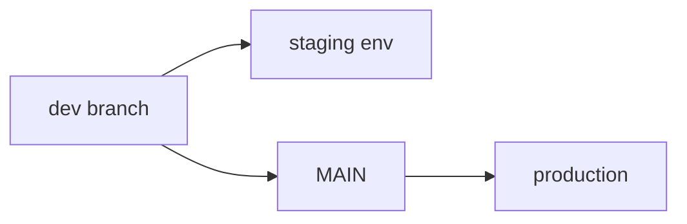
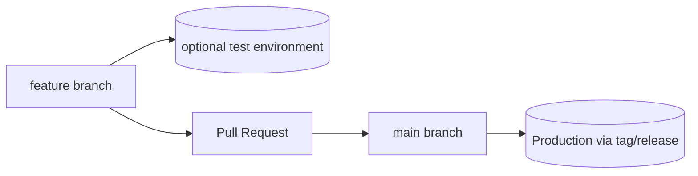

# Trunk-Based Development Migration Plan  
### Eliminating `dev` / `aks-dev` branches and using `main` as the single trunk

---

## ✅ What?

We are moving to **trunk-based development** across all repositories by:

1. Removing long-lived branches like `dev` and `aks-dev`
2. Using `main` as the **only permanent branch**
3. Allowing deployments to non-production environments **directly from feature branches** when needed (QA, UAT, demo, sandbox, etc.)

---

## ✅ Why?

### 1. Long-lived branches cause code drift and instability
- `dev` and `aks-dev` diverge from `main`, creating conflicts
- Merge becomes harder the longer the branch lives
- Debugging happens twice (in `dev`, then again in `main`)
- Hard to know what is actually running in production

### 2. Trunk-based development = faster, safer delivery
- `main` is **always releasable**
- Smaller and more frequent merges
- Automated CI/CD becomes simpler and more reliable
- Industry standard at companies like Google, Netflix, Meta, Amazon

### 3. One single source of truth
- No more “Does this exist in dev or only in main?”
- No manual branch syncing or rebase headaches
- No duplication of pipelines or environments

### 4. Still allows deploying unreleased features
- Feature branches can be deployed to test/non-prod envs
- Supports ephemeral preview environments (`pr-123.example.com`)
- No need for a permanent `dev` branch anymore

---

## ✅ How?

### Git Workflow Change

| Action | Old Flow | New Flow |
|--------|----------|----------|
| Development branch | `dev`, `aks-dev` | ❌ removed |
| Source of truth | unclear | ✅ `main` only |
| Work-in-progress | committed to `dev` | ✅ short-lived feature branches |
| Deploy to test env | from `dev` | ✅ from feature branch |
| Deploy to production | sometimes from `dev` | ✅ from `main` or a tagged release |

---

## ❌ Old Model (branch drift & merge pain)

### 🔴 Problems:

- `dev` contains code not in `main`
- Merges to `main` are big and risky
- Conflicts discovered late
- Extra work to sync branches
- Bugs only discovered after merge
- Two “_sources of truth_”

## ✅ New Model (trunk-based development)

### 🟢 Benefits:

- `main` always stable & deployable
- Fast & small merges
- Feature branches can still deploy to test
- No long-lived `dev` branch

# Workflow summary

1. Create branch → `feature/my-feature`
2. Push code → CI runs (lint, test, build)
3. (optional) Deploy from branch to non-prod/test environment 
4. Open PR → review → merge to `main`
5. `main` triggers deployment or release tag (`v1.2.3`)

